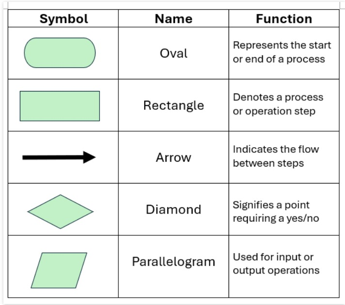
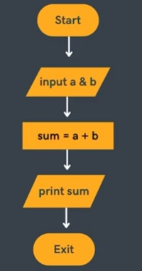
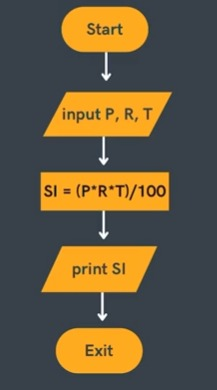
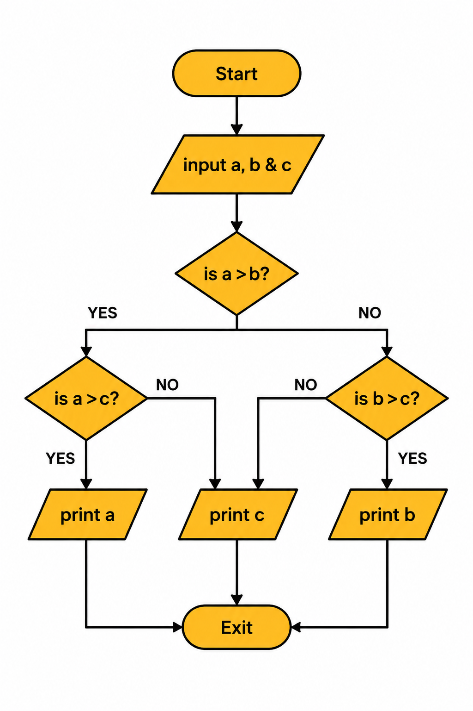
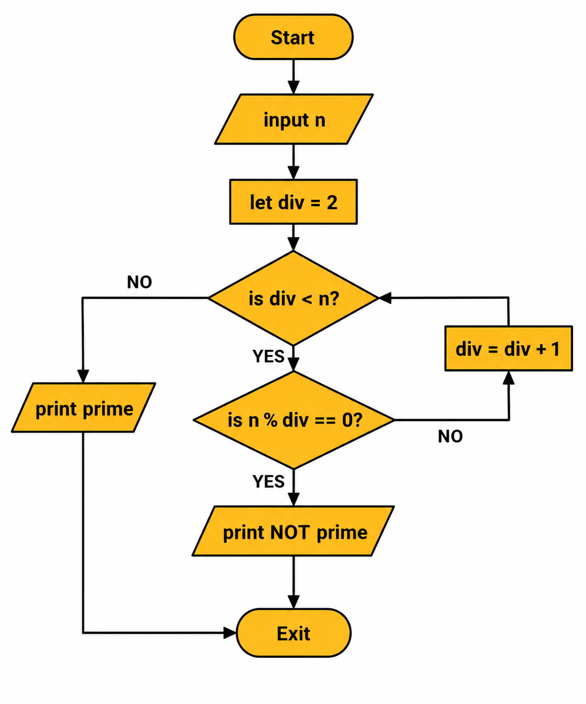
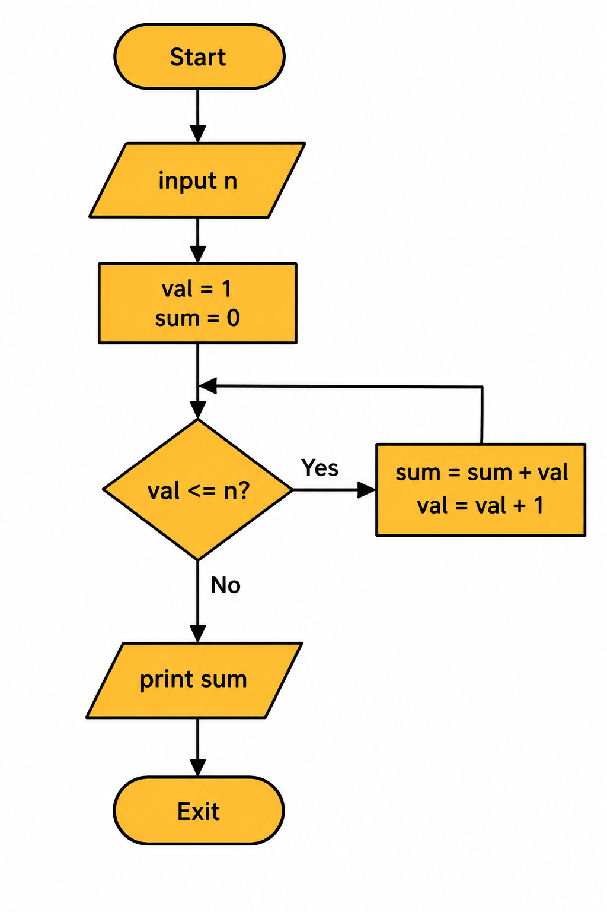
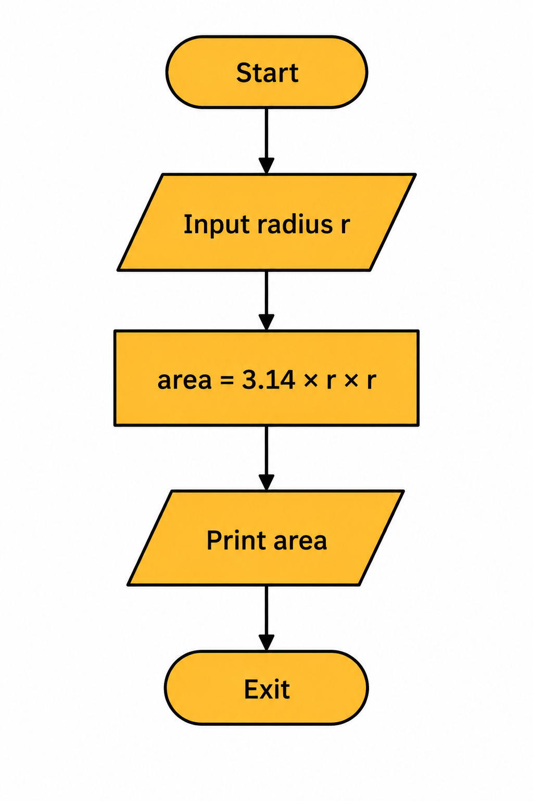
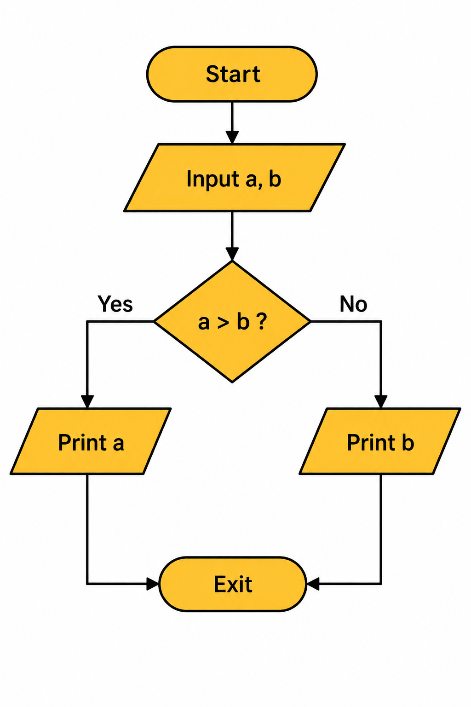
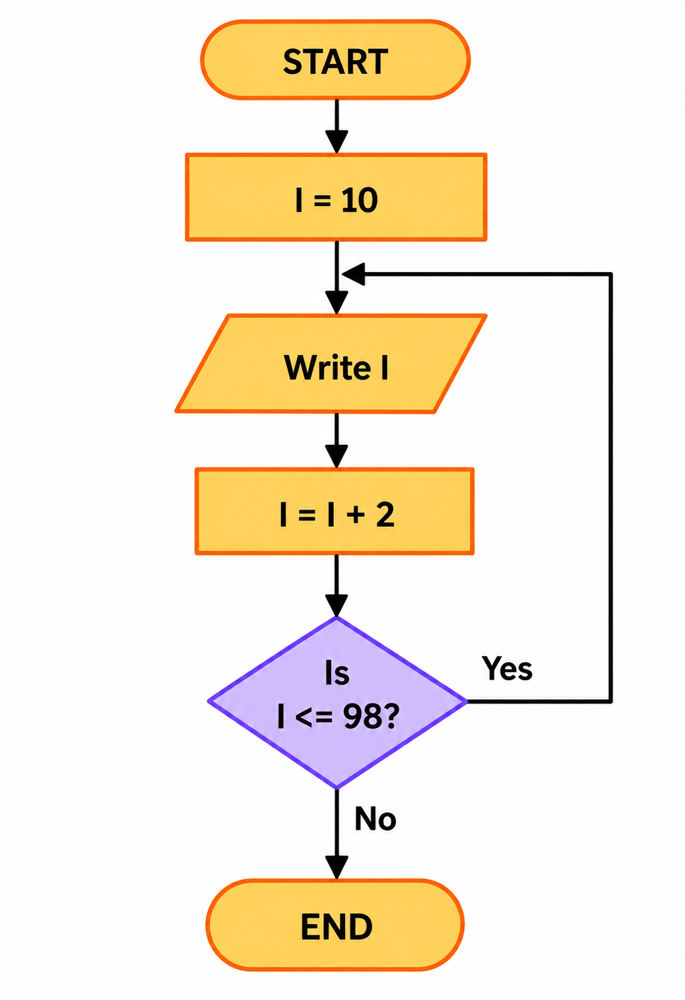
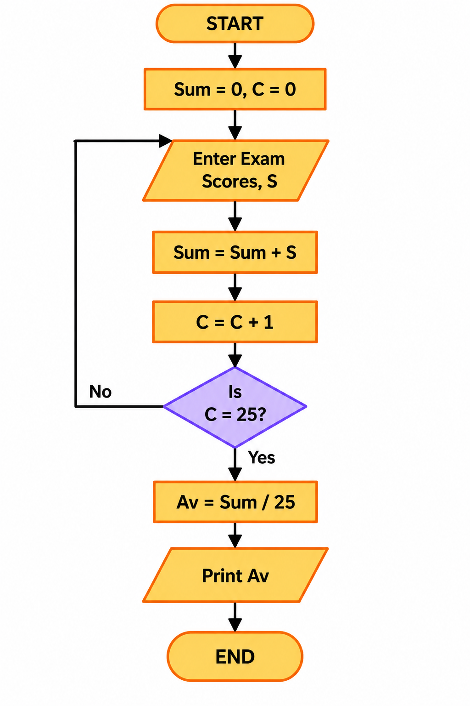

# Flowcharts: 
Diagram to represent solutions of problems

small parts --> logically arrange



# Examples:
1. Sum of two numbers:
input: first number 'a' & second number 'b'
output: sum of a & b

Flowchart:


Pseudocode:
```text 
    Step 1: Start
    Step 2: Input number a and b
    Step 3: Calculate sum = a + b
    Step 4: Print sum
    Step 5: Exit
```

2. Calculate simple interest:
input: principal 'P', rate 'R', time 'T'
output: SI = P*R*T / 100

Flowchart:


Pseudocode:
```text
    Step 1: Start
    Step 2: Input principal (P), rate (R), time (T)
    Step 3: Calculate SI = (P*R*T) / 100
    Step 4: Print SI
    Step 5: Exit
```

3. Find max of 3 numbers:
input: 3 numbers: a, b & c
output: max of 3

Flowchart:


Pseudocode:
```text
    Step 1: Start
    Step 2: Input a, b and c
    Step 3: if a > b do 
                if a > c do
                    print a
                else 
                    print c
            else
                if b > c do
                    print b
                else 
                    print c
    Step 4: Exit
``` 

4. Find if number is prime:
input: number 'n'
output: prime or not prime

Flowchart:


Pseudocode:
```text
    Step 1: Start
    Step 2: Input number 'n'
    Step 3: let div = 2
    Step 4: while div < n do
                if n % div == 0 do
                    print NOT PRIME
                    Exit
                else
                    div = div + 1
    Step 5: Print PRIME
    Step 6: Exit
```
NOTE: there is property for non-prime numbers i.e. if 'n' is my non-prime number then from 2 <----> n-1 there will a divisor that will completely divide the 'n'
e.g. 6: 2 <----> 5 there is 2 & 3 that completely divides the number 6.

5. Sum of first 'n' natural numbers:
input: number 'n'
output: sum of 1st 'n' natural numbers

Flowchart:


Pseudocode: 
```text
    Step 1: Start
    Step 2: Input number 'n'
    Step 3: let val = 1 & sum = 0
    Step 4: while val <= n do
                sum = sum + val
                val = val + 1
    Step 5: Print sum
    Step 6: Exit
``` 

6. Calculate area of a circle:
input: radius 'r'
output: area of circle

Flowchart:


Pseudocode:
```text
    Step 1: Start
    Step 2: Input radius 'r'
    Step 3: Calculate area = 3.14 * r * r
    Step 4: Print area
    Step 5: Exit
```

7. Find greatest from 2 numbers:
input: 2 numbers:  a & b
output: largest of 2

Flowchart:


Pseudocode:
```text
    Step 1: Start
    Step 2: Input a and b
    Step 3: if a > b do
                print a
            else
                print b
    Step 4: Exit
```

8. Print even numbers between 9 and 100:
input: 9 and 100
output: even numbers between 9 & 100

Flowchart:


Pseudocode:
```text
    Step 1: Start
    Step 2: let n = 9, end = 100
    Step 3: while n <= end
                if n % 2 == 0 do
                    print n
                n = n + 1
    Step 4: Exit
```

9. Calculate average from 25 exam scores:
input: 25 scores
output: average of 25 scores

Flowchart:


Pseudocode:
```text
    Step 1: Start
    Step 2: let sum = 0 and n = 1
    Step 3: while n <= 25
                Input score
                sum = sum + score
                n = n + 1
    Step 4: Calculate avg = sum / 25
    Step 5: Print avg
    Step 6: Exit
```