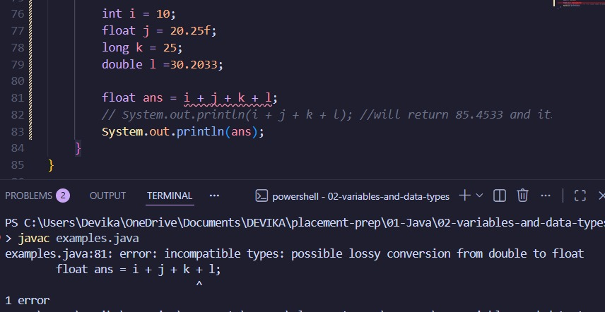
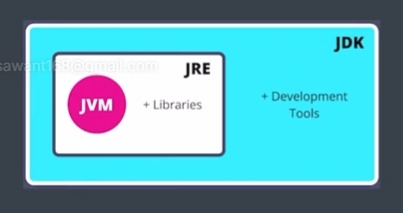
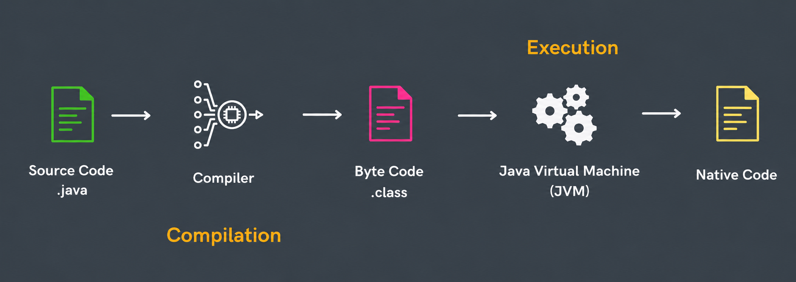
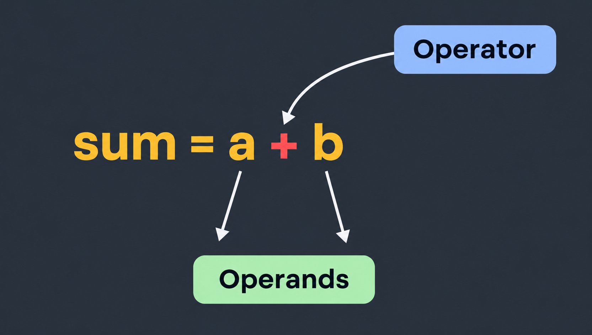
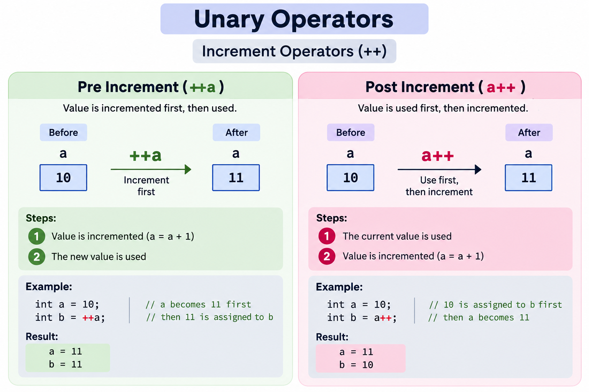
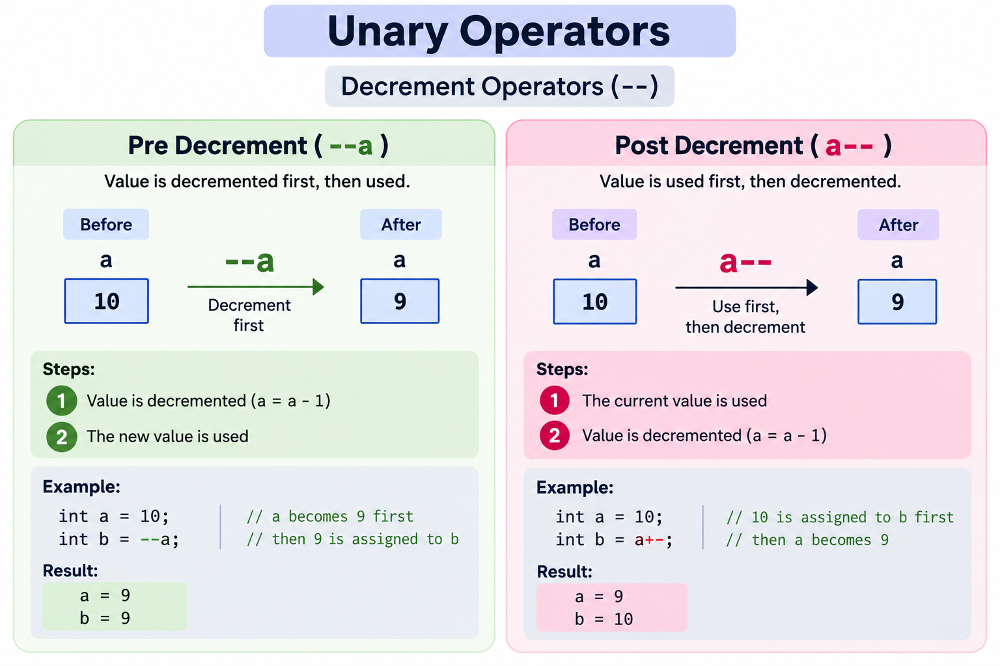

# Variables in Java:

a = 10, b = 5 then area of rectangle is 2 * (a + b)
Here, 2 is a lateral while a & b is a variable where the value of a & b can change.


NOTE: Names of variables are called identifiers in Java. Identifier rule says, identifiers can start with any alphabet or underscore (“_”) or dollar (“$”). 

# Data Types in Java:
    ## Primitive: data types that already exists in Java
        - byte
        - short
        - char
        - boolean
        - int
        - long
        - float
        - double
    
        --> Size of Data Types: 1 byte = 8 bits
            - byte --> 1 byte [-128 to 127] 256 nos
            - short --> 2 bytes
            - char --> 2 bytes ['a' to 'z', 'A' to 'Z', '@', '%', etc.]
            - boolean --> 1 byte [true OR false]
            - int --> 4 bytes [-2 billion to 2 billion]
            - long --> 8 bytes [larger number]
            - float --> 4 bytes [number with decimal]
            - double --> 8 bytes [larger decimal number]

    ## Non-Primitive: data types that are created by the programmer
        - String
        - Array
        - Class
        - Object
        - Interface

# Input in Java:
    - next() --> to print single word/string
    - nextLine() --> to print the entire sentence
    - nextInt() --> to print an integer
    - nextFloat() --> to print float/decimal number
    - nextByte() --> to print byte value
    - nextDouble() --> to print double value
    - nextBoolean() --> to print boolean value i.e. true or false
    - nextShort() 
    - nextLong () 

# Type Conversion: to convert one type of data to other type
    Conversion happens when:
        - type compatible (conversion between int <--> float is possible) (conversion between int <--> boolean is not possible)
        NOTE: We can only have conversion when both from one number type to another. As int and float have number as value so conversion is possible.
        - destination type > source type: Meaning int value can be stored in long but long value cannot be stored in int because int is 4 bytes while long is 8 bytes.

    `**byte -> short -> int -> float -> long -> double**`
    NOTE: type conversion is possible in above order, reverse of it is not possible as it will lead to **lossy conversion** i.e. there will be data loss.

    Type Conversion is also known as **Widnening Conversion** / **Implicit Conversion**

    **Type Conversion from char --> int is possible as every char has its own number assigned to it**

# Type Casting: Forcing the conversion of one data type into another, even if there may be a loss of data.
    e.g. 
```java
    float a = 10.22f;
    int b = (int)a;
```
    Type Casting is also known as **Narrowing Conversio** / **Explicit Conversion**

# Type Promotion in Expressions:
    - Java automatically promotes each byte, short, or char operand to int when evaluating an expression.
        e.g.
```java
        char a = 'a';
        short b = 50;
        //to do a + b java will first convert 'a' char and 'b' short into int and then it will add that integer.
```
        But,
```java
        char a = 'a';
        char b = 'b';
        char c = a + b; //this is not possible as we are trying to store the int value in char 'c'.
``` 
        NOTE: in above 'a' & 'b' are already converted into int that is why we cannot store it in 'c' as a char. 

    - If one operand is long, float or double the whole expression is promoted to long, float, or double respectively.
    Here, the type will be converted to the largest possible data type in the whole expression.

```java
        int a = 10;
        float b = 20.25f;
        long c = 25;
        double d = 20.2038;
        //if we try to sum them up i.e. a + b + c + d then the output will be in double because it is the largest possible data type in whole expression.
```


```java
    //wrong
    byte b = 5;
    b = b * 2;

    //right
    byte b = 5;
    b = (byte) (b * 2); //as 'b' is already converted into int due to type promotion so we have explicitly mention 'byte' for it to convert into byte data type.
```

# Working of Java Code:





NOTE: Java is a portable language meaning we can write java code in any machine (Window, Linux, MAC).

# Operators in Java: Symbols that tell compiler to perform some operation.



Types of Operators:
- Arithmetic Operators (Binary / Unary)
    1. Binary Operators: Needs two operands
    ```text
        '+', '-', '*', '/', '%'
    ```
    
    2. Unary Operators: Needs a single operand
    ```text
        ++ : simple way of writing 'a = a + 1'
            e.g.: a++ OR ++a
    ```
    

    ```text
        -- : simple way of writing 'a = a - 1'
            e.g.: a-- OR --a
    ```
    

- Relational Operators
```text
    '==', '!=', '>', '<', '>=', '<='
```

- Logical Operators
```text
    '&&' --> Logical AND 
    '||' --> Logical OR 
    '!' --> Logical NOT
```

- Bitwise Operators (ADVANCE LEVEL will continue in next chapter...)

- Assignement Operators
```text
    '=' --> 'a = 10'
    '+=' --> 'a = a + 10' OR 'a+=10'
    '-=' --> 'b = b - 5' OR 'b-=5'
    '*=' --> 'c = c * 10' OR 'c*=10'
    '/=' --> 'd = d / 5' OR 'd/=5'
```