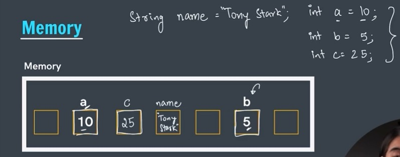

# Variables in Java:

a = 10, b = 5 then area of rectangle is 2 * (a + b)
Here, 2 is a lateral while a & b is a variable where the value of a & b can change.

# Data Types in Java:
    # Primitive: data types that already exists in Java
        - byte
        - short
        - char
        - boolean
        - int
        - long
        - float
        - double
    
        --> Size of Data Types: 1 byte = 8 bits
            - byte --> 1 byte [-128 to 127] 256 nos
            - short --> 2 bytes
            - char --> 2 bytes ['a' to 'z', 'A' to 'Z', '@', '%', etc.]
            - boolean --> 1 byte [true OR false]
            - int --> 4 bytes [-2 billion to 2 billion]
            - long --> 8 bytes [larger number]
            - float --> 4 bytes [number with decimal]
            - double --> 8 bytes [larger decimal number]

    # Non-Primitive: data types that are created by the programmer
        - String
        - Array
        - Class
        - Object
        - Interface

# Input in Java:
    - next() --> to print single word/string
    - nextLine() --> to print the entire sentence
    - nextInt() --> to print an integer
    - nextFloat() --> to print float/decimal number
    - nextByte() --> to print byte value
    - nextDouble() --> to print double value
    - nextBoolean() --> to print boolean value i.e. true or false
    - nextShort() 
    - nextLong () 