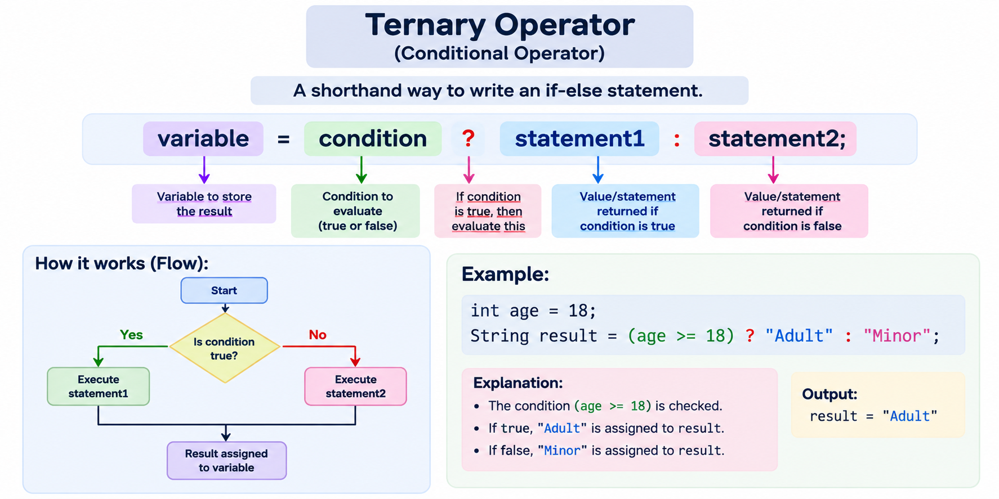

# Conditional Statements:

# if, else
```java
    if(condition) {
        //logic OR statement here
    }
    else {
        //logic OR statement here
    }
```

NOTE: if there is a single line statement is if, else then we can skip the curly braces {}
Example: 
```java
    if (condition)
        //statement here
    else
        //statement here
```
However, it is suggested to put braces.

# else if
```java
    if(condition 1) {
        //statement here
    }
    else if (condition 2) {
        //statement here
    }
    else {
        //statement here
    }
```

# ternary operator: Three operands
```java
    variable = condition? statement1 : statement2;
```


# switch statement: 
```java
    switch(variable) {
        case 1:
            break;
        case 2:
            break;
        case 3:
            break;
        default:
    }
```