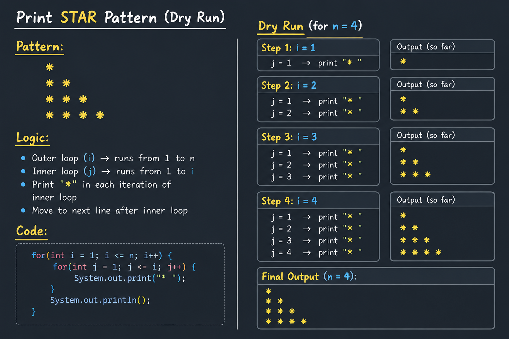
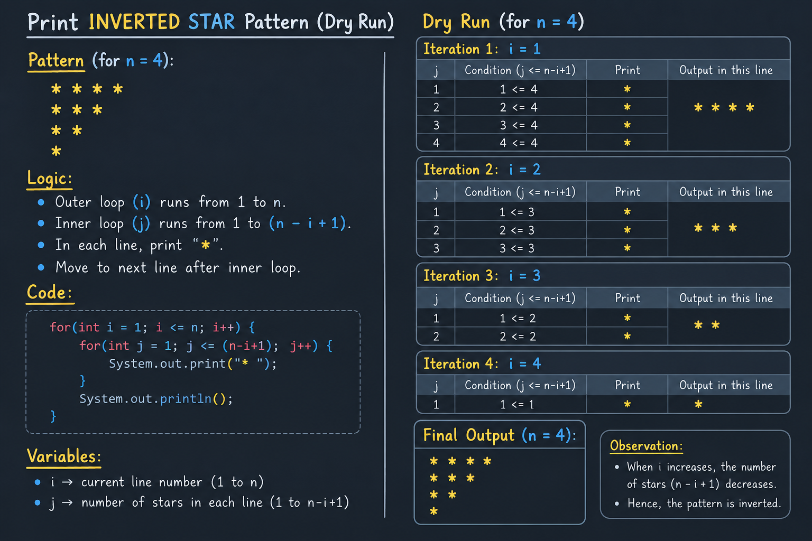
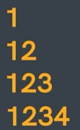
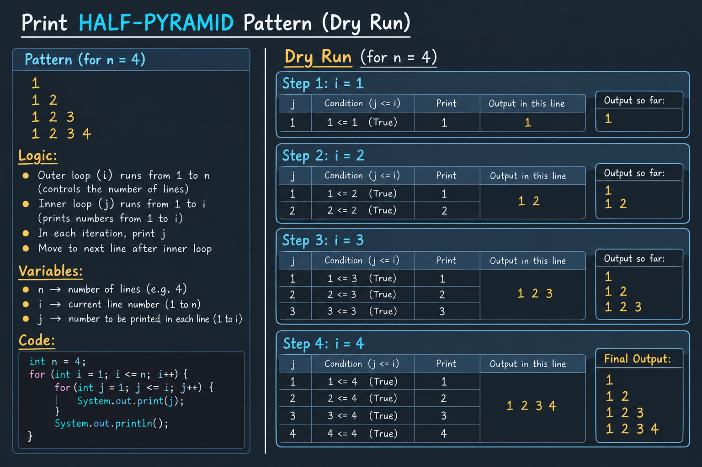
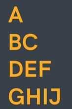
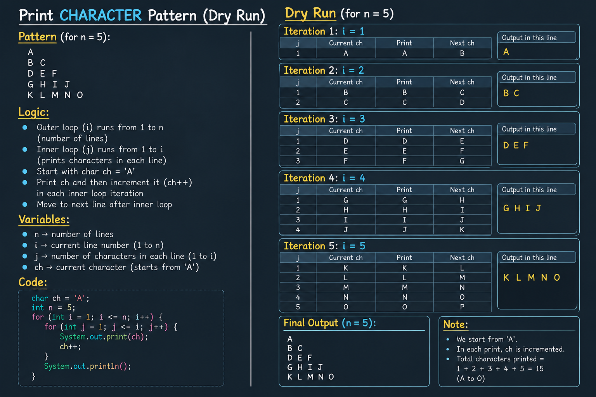

# PATTERNS (Basic):

## 1. Print STAR Pattern: 

### Logic:
```text    
    - number of lines is 4 (outer loop will run 4 times)
    - number of times the characters are printed in each line (inner loop)
    - what to print? ("*")
```
### Code:
[View Star Pattern Code](practice/StarPattern.java)
### Dry Run:

---

## 2. Print INVERTED-STAR Pattern:

### Logic:
```text
    - outer loop = no. of lines
    - inner loop = (char = n - i + 1)
    - 
```
### Code:
[View Inverted Star Pattern Code](practice/InvertedStarPattern.java)
### Dry Run:

---

## 3. Print HALF-PYRAMID Pattern:

### Logic:
```text
    - outer loop = total no. of lines
    - inner loop = 1 to no. of line (line = 1 so it will print 1, line = 2 so it will print 1 to 2 i.e. 1 2, line = 3 so it will print 1 to 3 i.e. 1 2 3 and so on...)
    - print number (to print inner loop's count)
```
### Code:
[View Half Pyramid Pattern Code](practice/HalfPyramidPattern.java)
### Dry Run:

---

## 4. Print CHARACTER Pattern:

### Logic:
```text
    - outer loop = no. of lines
    - inner loop = no. of lines == no. of char
    - what to print? char ch = 'A' --> to update the value of 'ch' by '1' everytime the loop runs
```
### Code:
[View Character Pattern Code](practice/CharacterPattern.java)
### Dry Run:

---

# PATTERNS (Advance):