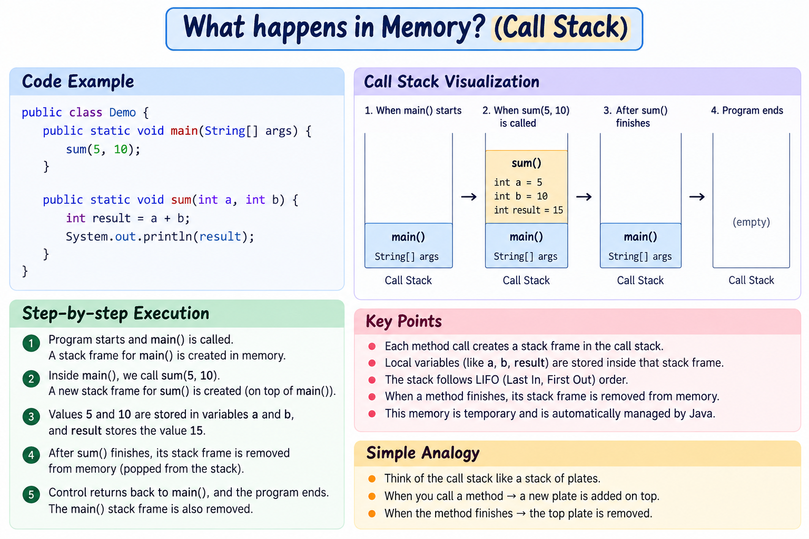
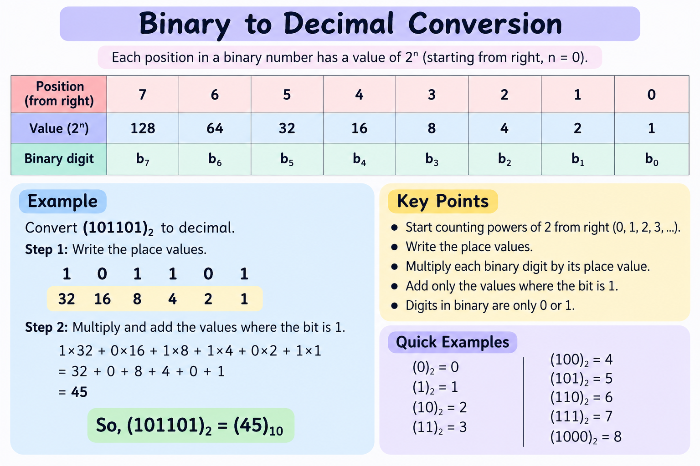
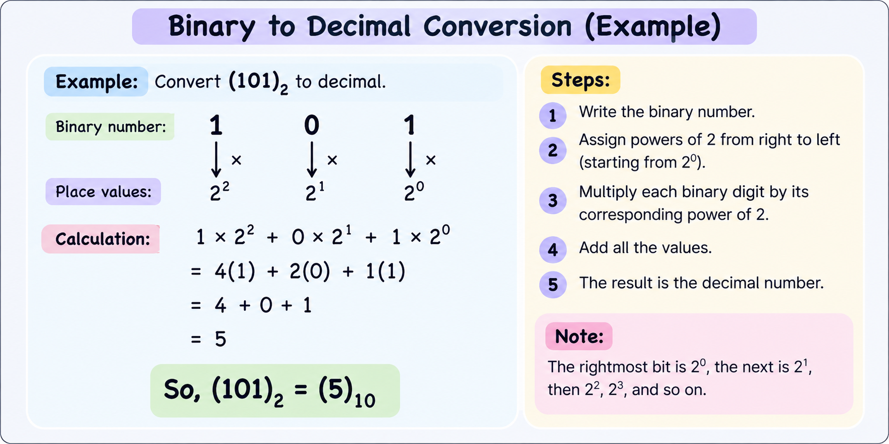
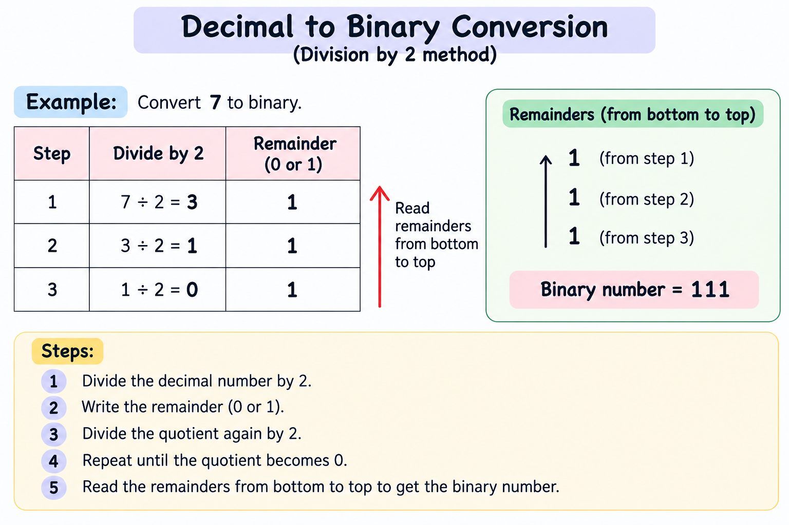

# Functions & Methods: 

## Functions: are a block of code which are reusable.

Syntax:
```java
    returnType name() {
        //body
        return statement;
    }
```
NOTE: Functions written inside the class are called Methods
Convetionally both are same, its just in java we usually write everything inside a class so the function inside the class is method.

Syntax with Parameters:
```java
    returnType name (type param1, type param2) {
        //body
        return statement;
    }
``` 

## What happens in Memory?

---
## Call by Value: Java always call by value

example: Swapping
[View Swap Code](practice/Swap.java)
In the above code, the swapped values are printed inside the `swap()` method.

However, if we try to swap the values inside the `swap()` method and then print `a` and `b` in the `main()` method, the original values will be printed.

This happens because Java uses **Call by Value**.

When we pass `a` and `b` to the method:

swap(a, b);

Java creates copies of their values and passes those copies to the method.

So, changing `a` and `b` inside the `swap()` method does not change the original variables in the `main()` method.

Simple example:
```text
    main()
a = 10
b = 20

        ↓ copies are passed

swap(a, b)
a = 10
b = 20

After swapping inside swap():
a = 20
b = 10

        ↓ returns to main()

main()
a = 10
b = 20   ← Original values remain unchanged
```

### Call by Reference

In **Call by Reference**, changes made inside a function affect the **original variable**. It is commonly used in **C++**.
---

## Methods (Functions)
### User Defined:
--> Such as, factorial, sum, product

### Inbuilt Method: 
--> Math: pow, sqrt, max, min
--> sc.nextInt() 
---

## Function Overloading
**Function Overloading** means creating multiple functions with the **same name** but with **different parameters**.

The parameters must differ in at least one of these ways:
    - Different number of parameters
    - Different data types of parameters
    - Different order of parameter data types

### Important Note
Changing **only the return type** is **not** Function Overloading.
❌ Not valid function overloading:
```java
int sum(int a, int b) { }

double sum(int a, int b) { }
```

## Binary Number System: 

0 to 9 : 0, 1, 2, 3, 4, 5, 6, 7, 8, 9 --> 10 digit (Decimal)
0, 1 : 2 digit (Binary)







# Scope: The area of the program where a variable or method can be accessed/used.

## Method Scope:
A variable declared **inside a method** can be used only inside that method.
```java
    void example() {
        int x = 10;
        System.out.println(x);
    }
```

## Block Scope:
A variable declared inside a block { } can be used only inside that block.
```java
    if (true) {
        int x = 10;
        System.out.println(x);  // right
    }

    System.out.println(x);      // wrong
```