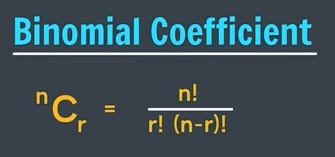

## Return V/S System.out.println()

### System.out.println()
- Used to display/show a value on the screen.
- The value is printed but cannot be directly used further.
```java
    System.out.println(5 + 3);
```

### return
- Used to send a value back from a method.
- The returned value can be stored and used later.
```java
    public static int add() {
        return 5 + 3;
    }
```
You can use the returned value:
```java
    int result = add();
    System.out.println(result);
```

println → Show the answer
return → Give the answer back to use later
---

## Parameters V/S Arguments

### Parameters: Parameters are variables written in the method definition.
They act as placeholders for the values that the method will receive.
```java
    public static void calculateSum(int n1, int n2) {
        int sum = n1 + n2;
        System.out.println(sum);
    }
```
Here,
n1 and n2 → Parameters

### Arguments: Arguments are the actual values passed when calling a method.
```java
    calculateSum(a, b);
```
Here,
a and b → Arguments

Parameters → Variables that receive the values 📥
Arguments → Actual values sent to the method 📤

## Q. Binomial Coefficient Code:
